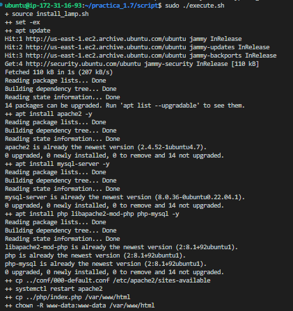
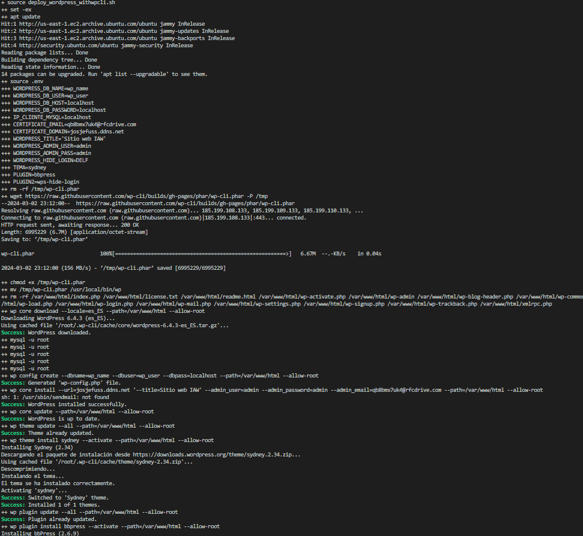
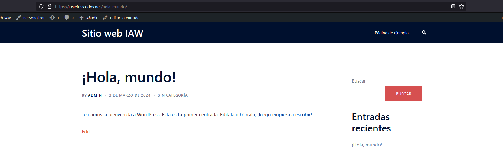

# Practica 1.7: Instalación y la configuración de WordPress utilizando la utilidad WP-CLI

Este repositorio contiene todos los archivos y scripts necesarios para la instalación y configuración automatizada de WordPress sobre una pila LAMP. A continuación se detalla el contenido del repositorio y su estructura.

## Contenido del Repositorio

- **Documento Técnico**: Describe detalladamente todos los pasos llevados a cabo durante el proceso de instalación y configuración.
- **Scripts de Bash**: Scripts utilizados para automatizar la instalación de la pila LAMP y la configuración de WordPress utilizando la utilidad WP-CLI.
- **Archivos de Configuración Adicionales**: Otros archivos de configuración necesarios para completar la instalación y configuración.

## Estructura del Repositorio

La estructura del repositorio es la siguiente:
```
.
├── README.md  
├── conf
│ └── 000-default.conf
├── htaccess
│ └── .htaccess
└── scripts
├── .env
├── install_lamp.sh
├── setup_letsencrypt_https.sh
└── deploy_wordpress_with_wpcli.s
```

## Contenido del Deploy

Este script automatiza la instalación y configuración de WordPress utilizando WP-CLI sobre una pila LAMP. A continuación se explican los pasos llevados a cabo:

### **Preparación del Entorno:**
   - Se configura para mostrar todos los comandos que se ejecutan (`set -ex`).
   - Se actualiza la lista de paquetes disponibles (`apt update`).
   - Se importan las variables del archivo `.env`.
   - Se eliminan instalaciones previas de wp-cli (`rm -rf /tmp/wp-cli.phar`).

### **Instalación de WP-CLI:**
   - Se descarga el archivo `wp-cli.phar` del repositorio oficial de WP-CLI.
   - Se le asignan permisos de ejecución y se mueve a `/usr/local/bin/` con el nombre `wp`.

### **Descarga y Configuración de WordPress:**
   - Se eliminan instalaciones anteriores de WordPress (`rm -rf /var/www/html/*`).
   - Se descarga el código fuente de WordPress en español al directorio `/var/www/html` utilizando `wp core download`.
   - Se crea el archivo de configuración `wp-config.php` para WordPress con los datos de la base de datos.

### **Instalación y Configuración Adicional:**
   - Se instala y configura WordPress con `wp core install`, proporcionando información como la URL, título, nombre de usuario y contraseña del administrador, y dirección de correo electrónico.
   - Se actualizan los plugins y temas con `wp core update`, `wp theme update`, y `wp plugin update`.
   - Se instala y activa un tema específico con `wp theme install --activate`.
   - Se instala y activa uno o varios plugins con `wp plugin install --activate`.
   - Se configuran los permalinks con la estructura `/%postname%/` con `wp rewrite structure`.
   - Se modifica el nombre de acceso predeterminado proporcionado por el plugin wpd-hide-login.
   - Se copia el archivo `.htaccess` desde el directorio `../htaccess/` al directorio raíz de WordPress.
   - Se modifica el propietario y grupo del directorio `/var/www/html` para que sea accesible por el servidor web.
## Ejecucion de los Scripts
### install_lamp


### deploy_wordpress_withwpcli

## Pagina Funcionando

